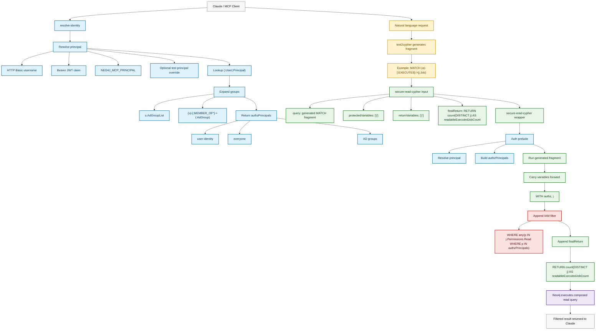

# Neo4j MCP IAM

This repo is an experimental IAM-aware fork of the Neo4j MCP server. It explores a query-mediation pattern for graphs where access is stored as list-valued permissions on domain nodes, for example:

```cypher
(:Job {
  `Permissions.Read`: ["everyone", "group2"],
  `Permissions.Create`: ["group1"],
  `Permissions.Update`: ["group1"],
  `Permissions.Delete`: ["group1"]
})
```

The core idea is simple: SSO identifies the user, the graph resolves the user's effective groups, and `secure-read-cypher` composes an authorization wrapper around text-to-Cypher output before Neo4j executes it.

## Current Test Model

For the local proof of concept, the useful graph shape is intentionally small:

```cypher
(:User)-[:MEMBER_OF]->(:AdGroup)
()-[:EXECUTES]->(:Job)
```

Users may also carry a direct group list:

```cypher
(:User {
  name: "johnny.kinnaird@neo4j.com",
  AdGroupList: ["everyone", "group1", "group2"]
})
```

`AdGroup` nodes are identity metadata only. CRUD permissions live on `:Job` nodes via `Permissions.Read`, `Permissions.Create`, `Permissions.Update`, and `Permissions.Delete`.

## Tools

- `get-schema` inspects labels, relationship types, and property keys.
- `resolve-identity` resolves the current or test-impersonated principal and expands IAM groups.
- `secure-read-cypher` runs a generated Cypher fragment inside the IAM wrapper.
- `write-cypher` still exists in the codebase, but should be hidden for Claude testing with `NEO4J_READ_ONLY=true`.
- Raw `read-cypher` is intentionally not registered in this IAM build, because it would bypass the IAM filter.

## Secure Read Flow

`secure-read-cypher` owns the security-sensitive parts of the query:

```text
auth prelude
  + generated text2cypher fragment
  + IAM WHERE filter
  + final RETURN / aggregate
```

Example tool input:

```json
{
  "principal": "johnny.kinnaird@neo4j.com",
  "query": "MATCH (a)-[:EXECUTES]->(j:Job)",
  "protectedVariables": ["j"],
  "returnVariables": ["j"],
  "finalReturn": "RETURN count(DISTINCT j) AS readableExecutedJobCount"
}
```

The generated Cypher fragment must not include `RETURN`. Aggregates belong in `finalReturn` so they run after the IAM filter.

## Run Flow Sketch



Equivalent composed query shape:

```cypher
// secure-read-cypher auth prelude
CALL {
  MATCH (u)
  WHERE u.schemaId IS NULL
    AND any(label IN labels(u) WHERE label IN ['User', 'Principal'])
    AND any(key IN ['username', 'email', 'mail', 'userPrincipalName', 'upn', 'name', 'id']
            WHERE u[key] IS NOT NULL
              AND toLower(toString(u[key])) = toLower($__secure_auth_principal))

  OPTIONAL MATCH (u)-[:MEMBER_OF|MEMBER_OF_GROUP|IN_GROUP|HAS_GROUP*1..]->(g)
  WHERE g.schemaId IS NULL

  WITH u,
       collect(DISTINCT coalesce(g.name, g.group, g.displayName, g.email, g.mail, g.id)) AS groupPrincipals

  RETURN {
    principalId: coalesce(u.id, u.email, u.userPrincipalName, u.upn, u.name),
    tenantId: u.tenantId,
    authzPrincipals: [p IN groupPrincipals + coalesce(u.AdGroupList, []) + [
      coalesce(u.username, u.email, u.userPrincipalName, u.upn, u.name, u.id),
      'everyone'
    ] WHERE p IS NOT NULL]
  } AS authz
}

// generated text2cypher fragment
CALL {
  WITH authz
  MATCH (a)-[:EXECUTES]->(j:Job)
  RETURN j
}

// wrapper-applied authorization
WITH authz, j
WHERE any(p IN coalesce(j.`Permissions.Read`, [])
          WHERE p IN authz.authzPrincipals)

// wrapper-owned final aggregate
RETURN count(DISTINCT j) AS readableExecutedJobCount
```

## Local Environment

Create a local `.env` file for development:

```bash
NEO4J_URI=bolt://localhost:7687
NEO4J_USERNAME=neo4j
NEO4J_PASSWORD=testtest
NEO4J_DATABASE=neo4j
```

`.env` is ignored by git.

## Claude Desktop Config

Example MCP config:

```json
{
  "neo4j-mcp-iam": {
    "command": "/usr/local/bin/neo4j-iam-mcp",
    "args": [],
    "env": {
      "NEO4J_URI": "bolt://localhost:7687",
      "NEO4J_USERNAME": "neo4j",
      "NEO4J_PASSWORD": "testtest",
      "NEO4J_DATABASE": "neo4j",
      "NEO4J_READ_ONLY": "true",
      "NEO4J_TELEMETRY": "false",
      "NEO4J_LOG_LEVEL": "info",
      "NEO4J_LOG_FORMAT": "text",
      "NEO4J_SCHEMA_SAMPLE_SIZE": "100",
      "NEO4J_MCP_PRINCIPAL": "michael.moore@neo4j.com",
      "NEO4J_MCP_ALLOW_IMPERSONATION": "true"
    }
  }
}
```

`NEO4J_MCP_ALLOW_IMPERSONATION=true` is for local testing only. It allows a tool call to pass `"principal": "johnny.kinnaird@neo4j.com"`.

## Suggested Claude Prompt

```text
You have access to a Neo4j IAM-aware MCP server named neo4j-mcp-iam.

Use resolve-identity first to confirm the current principal and IAM groups.

For this test, only work with these relationships:
- (:User)-[:MEMBER_OF]->(:AdGroup)
- ()-[:EXECUTES]->(:Job)

Ignore all other relationship types unless explicitly asked.

For all data queries, use secure-read-cypher only. Do not use raw Cypher tools if they appear.

Generate read-only Cypher fragments only. The query field for secure-read-cypher should be the middle graph pattern or match fragment, without a RETURN clause.

For job access questions, generate fragments over EXECUTES, for example:
MATCH (a)-[:EXECUTES]->(j:Job)

Use protectedVariables to identify variables that need IAM filtering, usually ["j"] for jobs.

Use returnVariables to keep variables needed by the final result in scope.

Use finalReturn for the final projection or aggregate after IAM filtering, for example:
RETURN j
RETURN count(DISTINCT j) AS readableExecutedJobCount

Do not attempt writes, schema changes, procedure calls, or unrestricted queries.
```

## Build And Run

Build the IAM binary:

```bash
task build
```

Run the compiled binary:

```bash
task run:compiled
```

Install for Claude Desktop:

```bash
sudo install -m 0755 bin/neo4j-iam-mcp /usr/local/bin/neo4j-iam-mcp
```

Developer watch mode rebuilds on source changes:

```bash
task dev:watch
```

To rebuild and install on every change, run from a shell that can write to `/usr/local/bin`:

```bash
sudo INSTALL_TO=/usr/local/bin/neo4j-iam-mcp ./scripts/dev-rebuild.sh
```

## Verification

Focused checks used during development:

```bash
GOCACHE=/private/tmp/neo4j-mcp-iam-go-cache go test ./internal/tools/iam ./internal/tools/cypher
GOCACHE=/private/tmp/neo4j-mcp-iam-go-cache go test ./internal/server -run TestToolRegister
GOCACHE=/private/tmp/neo4j-mcp-iam-go-cache go build -C cmd/neo4j-mcp -o ../../bin/neo4j-iam-mcp
```

The full server test suite includes HTTP lifecycle tests that bind local ports; those may need a less restricted shell environment.
